# Tutorial: Criação de Projeto Modbus no CODESYS V3.5 SP21 utilizando ESP_Remote_IO

## 🎯 Objetivo

Orientar passo a passo a criação de um projeto Modbus TCP no CODESYS V3.5 SP21,
permitindo que uma ESP32 funcione como uma **Remota Modbus TCP**.

## 👥 Público-alvo

- Alunos e profissionais de Automação Industrial
- Disciplina Instrumentação Industrial II – UFU

## 🧰 Pré-requisitos

- Windows 11
- CODESYS V3.5 SP21
- ESP32 com firmware ESP_Remote_IO
- Rede Ethernet configurada

## 📋 Checklist antes de iniciar

- [ ] CODESYS instalado
- [ ] ESP32 ligada
- [ ] IP configurado
- [ ] Projeto salvo

## 🧭 Passo a passo

### 🔹 Passo 1 – Etapa 1 da configuração Modbus

- Acessar a opção indicada na imagem.
- Realizar a configuração destacada pelo marcador **1**.
- Confirmar os parâmetros conforme o projeto Modbus.
- Validar se o item foi corretamente inserido na árvore do CODESYS.

⚠️ Atenção: qualquer valor diferente do mostrado na imagem pode impedir a comunicação.
💡 Dica: sempre salvar o projeto após concluir este passo.

---

### 🔹 Passo 2 – Etapa 2 da configuração Modbus
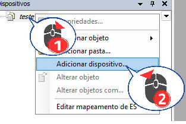

- Acessar a opção indicada na imagem.
- Realizar a configuração destacada pelo marcador **2**.
- Confirmar os parâmetros conforme o projeto Modbus.
- Validar se o item foi corretamente inserido na árvore do CODESYS.

⚠️ Atenção: qualquer valor diferente do mostrado na imagem pode impedir a comunicação.
💡 Dica: sempre salvar o projeto após concluir este passo.

---

### 🔹 Passo 3 – Etapa 3 da configuração Modbus

- Acessar a opção indicada na imagem.
- Realizar a configuração destacada pelo marcador **3**.
- Confirmar os parâmetros conforme o projeto Modbus.
- Validar se o item foi corretamente inserido na árvore do CODESYS.

⚠️ Atenção: qualquer valor diferente do mostrado na imagem pode impedir a comunicação.
💡 Dica: sempre salvar o projeto após concluir este passo.

---

### 🔹 Passo 4 – Etapa 4 da configuração Modbus

- Acessar a opção indicada na imagem.
- Realizar a configuração destacada pelo marcador **4**.
- Confirmar os parâmetros conforme o projeto Modbus.
- Validar se o item foi corretamente inserido na árvore do CODESYS.

⚠️ Atenção: qualquer valor diferente do mostrado na imagem pode impedir a comunicação.
💡 Dica: sempre salvar o projeto após concluir este passo.

---

### 🔹 Passo 5 – Etapa 5 da configuração Modbus

- Acessar a opção indicada na imagem.
- Realizar a configuração destacada pelo marcador **5**.
- Confirmar os parâmetros conforme o projeto Modbus.
- Validar se o item foi corretamente inserido na árvore do CODESYS.

⚠️ Atenção: qualquer valor diferente do mostrado na imagem pode impedir a comunicação.
💡 Dica: sempre salvar o projeto após concluir este passo.

---

### 🔹 Passo 6 – Etapa 6 da configuração Modbus

- Acessar a opção indicada na imagem.
- Realizar a configuração destacada pelo marcador **6**.
- Confirmar os parâmetros conforme o projeto Modbus.
- Validar se o item foi corretamente inserido na árvore do CODESYS.

⚠️ Atenção: qualquer valor diferente do mostrado na imagem pode impedir a comunicação.
💡 Dica: sempre salvar o projeto após concluir este passo.

---

### 🔹 Passo 7 – Etapa 7 da configuração Modbus

- Acessar a opção indicada na imagem.
- Realizar a configuração destacada pelo marcador **7**.
- Confirmar os parâmetros conforme o projeto Modbus.
- Validar se o item foi corretamente inserido na árvore do CODESYS.

⚠️ Atenção: qualquer valor diferente do mostrado na imagem pode impedir a comunicação.
💡 Dica: sempre salvar o projeto após concluir este passo.

---

### 🔹 Passo 8 – Etapa 8 da configuração Modbus

- Acessar a opção indicada na imagem.
- Realizar a configuração destacada pelo marcador **8**.
- Confirmar os parâmetros conforme o projeto Modbus.
- Validar se o item foi corretamente inserido na árvore do CODESYS.

⚠️ Atenção: qualquer valor diferente do mostrado na imagem pode impedir a comunicação.
💡 Dica: sempre salvar o projeto após concluir este passo.

---

### 🔹 Passo 9 – Etapa 9 da configuração Modbus

- Acessar a opção indicada na imagem.
- Realizar a configuração destacada pelo marcador **9**.
- Confirmar os parâmetros conforme o projeto Modbus.
- Validar se o item foi corretamente inserido na árvore do CODESYS.

⚠️ Atenção: qualquer valor diferente do mostrado na imagem pode impedir a comunicação.
💡 Dica: sempre salvar o projeto após concluir este passo.

---

### 🔹 Passo 10 – Etapa 10 da configuração Modbus

- Acessar a opção indicada na imagem.
- Realizar a configuração destacada pelo marcador **10**.
- Confirmar os parâmetros conforme o projeto Modbus.
- Validar se o item foi corretamente inserido na árvore do CODESYS.

⚠️ Atenção: qualquer valor diferente do mostrado na imagem pode impedir a comunicação.
💡 Dica: sempre salvar o projeto após concluir este passo.

---

### 🔹 Passo 11 – Etapa 11 da configuração Modbus
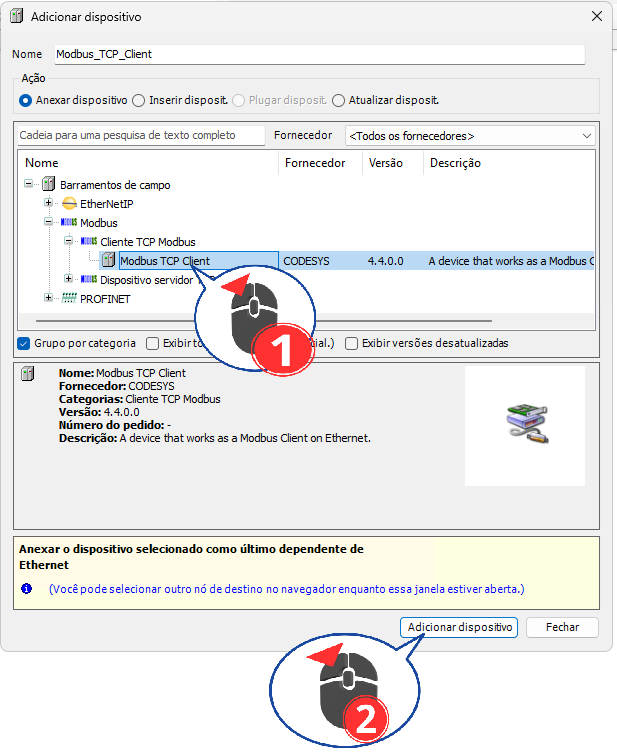

- Acessar a opção indicada na imagem.
- Realizar a configuração destacada pelo marcador **11**.
- Confirmar os parâmetros conforme o projeto Modbus.
- Validar se o item foi corretamente inserido na árvore do CODESYS.

⚠️ Atenção: qualquer valor diferente do mostrado na imagem pode impedir a comunicação.
💡 Dica: sempre salvar o projeto após concluir este passo.

---

### 🔹 Passo 12 – Etapa 12 da configuração Modbus
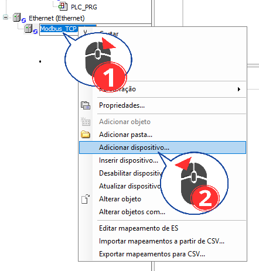

- Acessar a opção indicada na imagem.
- Realizar a configuração destacada pelo marcador **12**.
- Confirmar os parâmetros conforme o projeto Modbus.
- Validar se o item foi corretamente inserido na árvore do CODESYS.

⚠️ Atenção: qualquer valor diferente do mostrado na imagem pode impedir a comunicação.
💡 Dica: sempre salvar o projeto após concluir este passo.

---

### 🔹 Passo 13 – Etapa 13 da configuração Modbus
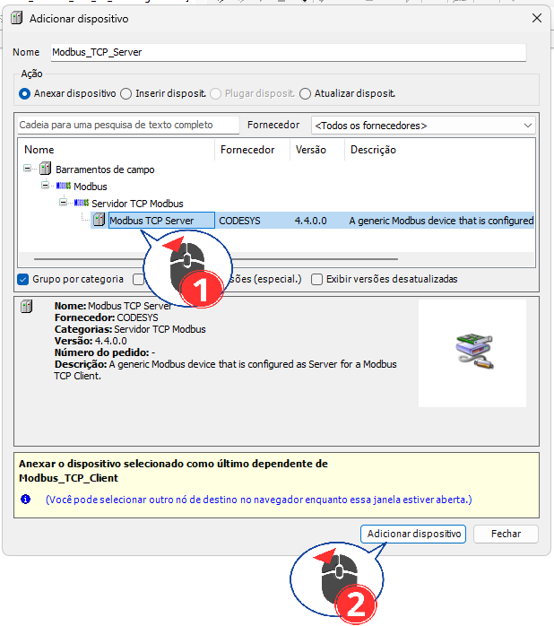

- Acessar a opção indicada na imagem.
- Realizar a configuração destacada pelo marcador **13**.
- Confirmar os parâmetros conforme o projeto Modbus.
- Validar se o item foi corretamente inserido na árvore do CODESYS.

⚠️ Atenção: qualquer valor diferente do mostrado na imagem pode impedir a comunicação.
💡 Dica: sempre salvar o projeto após concluir este passo.

---

### 🔹 Passo 14 – Etapa 14 da configuração Modbus

- Acessar a opção indicada na imagem.
- Realizar a configuração destacada pelo marcador **14**.
- Confirmar os parâmetros conforme o projeto Modbus.
- Validar se o item foi corretamente inserido na árvore do CODESYS.

⚠️ Atenção: qualquer valor diferente do mostrado na imagem pode impedir a comunicação.
💡 Dica: sempre salvar o projeto após concluir este passo.

---

### 🔹 Passo 15 – Etapa 15 da configuração Modbus

- Acessar a opção indicada na imagem.
- Realizar a configuração destacada pelo marcador **15**.
- Confirmar os parâmetros conforme o projeto Modbus.
- Validar se o item foi corretamente inserido na árvore do CODESYS.

⚠️ Atenção: qualquer valor diferente do mostrado na imagem pode impedir a comunicação.
💡 Dica: sempre salvar o projeto após concluir este passo.

---

### 🔹 Passo 16 – Etapa 16 da configuração Modbus
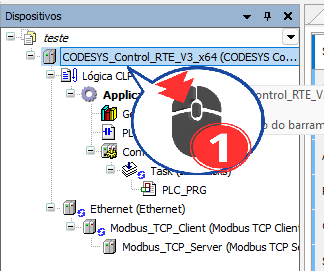

- Acessar a opção indicada na imagem.
- Realizar a configuração destacada pelo marcador **16**.
- Confirmar os parâmetros conforme o projeto Modbus.
- Validar se o item foi corretamente inserido na árvore do CODESYS.

⚠️ Atenção: qualquer valor diferente do mostrado na imagem pode impedir a comunicação.
💡 Dica: sempre salvar o projeto após concluir este passo.

---

### 🔹 Passo 17 – Etapa 17 da configuração Modbus

- Acessar a opção indicada na imagem.
- Realizar a configuração destacada pelo marcador **17**.
- Confirmar os parâmetros conforme o projeto Modbus.
- Validar se o item foi corretamente inserido na árvore do CODESYS.

⚠️ Atenção: qualquer valor diferente do mostrado na imagem pode impedir a comunicação.
💡 Dica: sempre salvar o projeto após concluir este passo.

---

### 🔹 Passo 18 – Etapa 18 da configuração Modbus
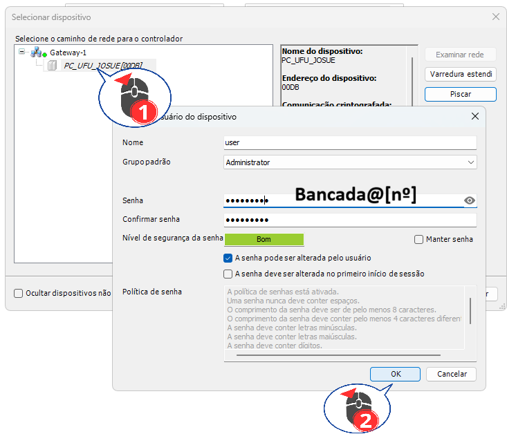

- Acessar a opção indicada na imagem.
- Realizar a configuração destacada pelo marcador **18**.
- Confirmar os parâmetros conforme o projeto Modbus.
- Validar se o item foi corretamente inserido na árvore do CODESYS.

⚠️ Atenção: qualquer valor diferente do mostrado na imagem pode impedir a comunicação.
💡 Dica: sempre salvar o projeto após concluir este passo.

---

### 🔹 Passo 19 – Etapa 19 da configuração Modbus
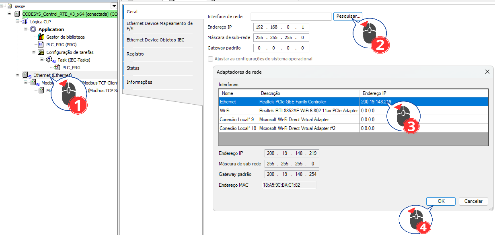

- Acessar a opção indicada na imagem.
- Realizar a configuração destacada pelo marcador **19**.
- Confirmar os parâmetros conforme o projeto Modbus.
- Validar se o item foi corretamente inserido na árvore do CODESYS.

⚠️ Atenção: qualquer valor diferente do mostrado na imagem pode impedir a comunicação.
💡 Dica: sempre salvar o projeto após concluir este passo.

---

### 🔹 Passo 20 – Etapa 20 da configuração Modbus
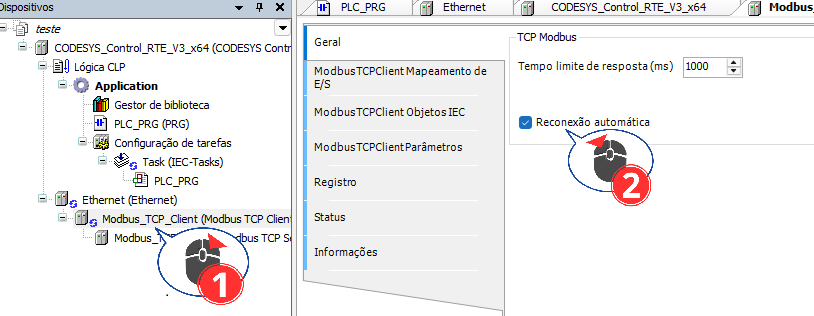

- Acessar a opção indicada na imagem.
- Realizar a configuração destacada pelo marcador **20**.
- Confirmar os parâmetros conforme o projeto Modbus.
- Validar se o item foi corretamente inserido na árvore do CODESYS.

⚠️ Atenção: qualquer valor diferente do mostrado na imagem pode impedir a comunicação.
💡 Dica: sempre salvar o projeto após concluir este passo.

---

### 🔹 Passo 21 – Etapa 21 da configuração Modbus
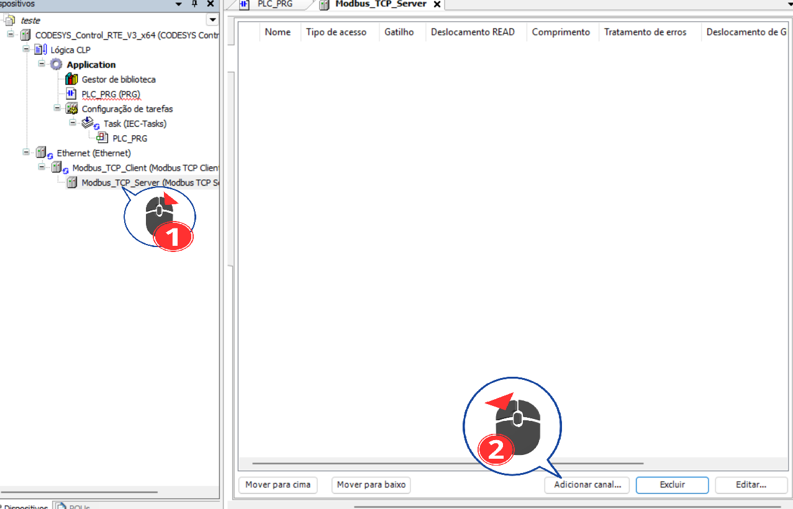

- Acessar a opção indicada na imagem.
- Realizar a configuração destacada pelo marcador **21**.
- Confirmar os parâmetros conforme o projeto Modbus.
- Validar se o item foi corretamente inserido na árvore do CODESYS.

⚠️ Atenção: qualquer valor diferente do mostrado na imagem pode impedir a comunicação.
💡 Dica: sempre salvar o projeto após concluir este passo.

---

### 🔹 Passo 22 – Etapa 22 da configuração Modbus
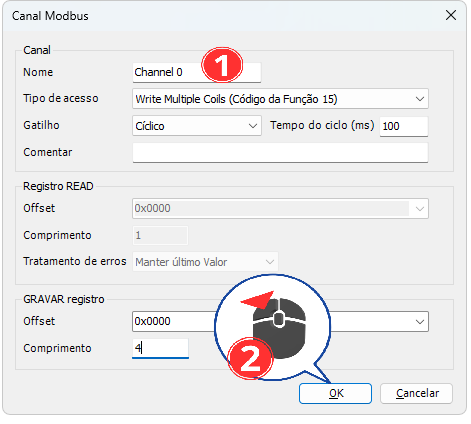

- Acessar a opção indicada na imagem.
- Realizar a configuração destacada pelo marcador **22**.
- Confirmar os parâmetros conforme o projeto Modbus.
- Validar se o item foi corretamente inserido na árvore do CODESYS.

⚠️ Atenção: qualquer valor diferente do mostrado na imagem pode impedir a comunicação.
💡 Dica: sempre salvar o projeto após concluir este passo.

---

### 🔹 Passo 23 – Etapa 23 da configuração Modbus
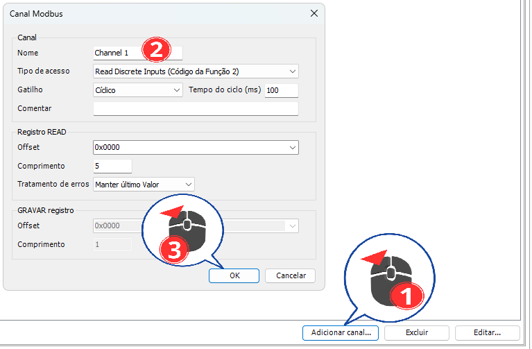

- Acessar a opção indicada na imagem.
- Realizar a configuração destacada pelo marcador **23**.
- Confirmar os parâmetros conforme o projeto Modbus.
- Validar se o item foi corretamente inserido na árvore do CODESYS.

⚠️ Atenção: qualquer valor diferente do mostrado na imagem pode impedir a comunicação.
💡 Dica: sempre salvar o projeto após concluir este passo.

---

### 🔹 Passo 24 – Etapa 24 da configuração Modbus
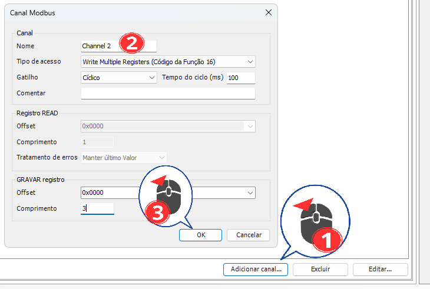

- Acessar a opção indicada na imagem.
- Realizar a configuração destacada pelo marcador **24**.
- Confirmar os parâmetros conforme o projeto Modbus.
- Validar se o item foi corretamente inserido na árvore do CODESYS.

⚠️ Atenção: qualquer valor diferente do mostrado na imagem pode impedir a comunicação.
💡 Dica: sempre salvar o projeto após concluir este passo.

---

### 🔹 Passo 25 – Etapa 25 da configuração Modbus
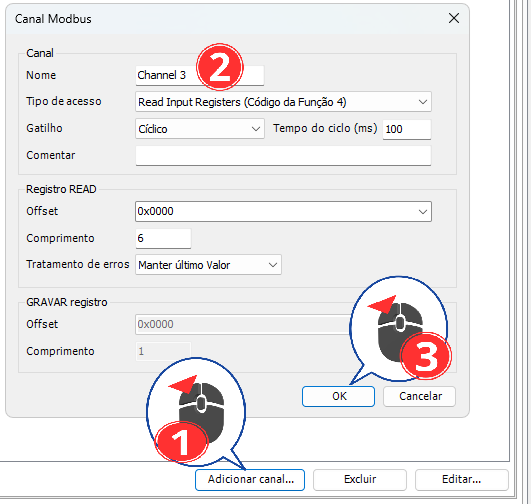

- Acessar a opção indicada na imagem.
- Realizar a configuração destacada pelo marcador **25**.
- Confirmar os parâmetros conforme o projeto Modbus.
- Validar se o item foi corretamente inserido na árvore do CODESYS.

⚠️ Atenção: qualquer valor diferente do mostrado na imagem pode impedir a comunicação.
💡 Dica: sempre salvar o projeto após concluir este passo.

---

### 🔹 Passo 26 – Etapa 26 da configuração Modbus

- Acessar a opção indicada na imagem.
- Realizar a configuração destacada pelo marcador **26**.
- Confirmar os parâmetros conforme o projeto Modbus.
- Validar se o item foi corretamente inserido na árvore do CODESYS.

⚠️ Atenção: qualquer valor diferente do mostrado na imagem pode impedir a comunicação.
💡 Dica: sempre salvar o projeto após concluir este passo.

---

### 🔹 Passo 27 – Etapa 27 da configuração Modbus
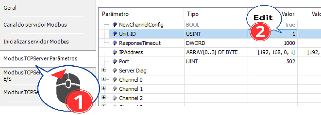

- Acessar a opção indicada na imagem.
- Realizar a configuração destacada pelo marcador **27**.
- Confirmar os parâmetros conforme o projeto Modbus.
- Validar se o item foi corretamente inserido na árvore do CODESYS.

⚠️ Atenção: qualquer valor diferente do mostrado na imagem pode impedir a comunicação.
💡 Dica: sempre salvar o projeto após concluir este passo.

---

### 🔹 Passo 28 – Etapa 28 da configuração Modbus
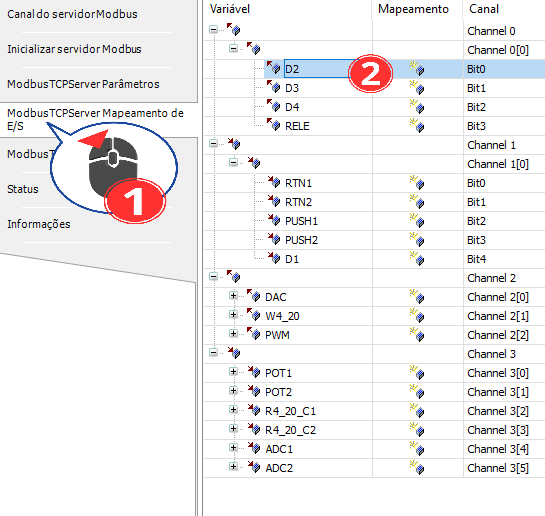

- Acessar a opção indicada na imagem.
- Realizar a configuração destacada pelo marcador **28**.
- Confirmar os parâmetros conforme o projeto Modbus.
- Validar se o item foi corretamente inserido na árvore do CODESYS.

⚠️ Atenção: qualquer valor diferente do mostrado na imagem pode impedir a comunicação.
💡 Dica: sempre salvar o projeto após concluir este passo.

---

### 🔹 Passo 29 – Etapa 29 da configuração Modbus
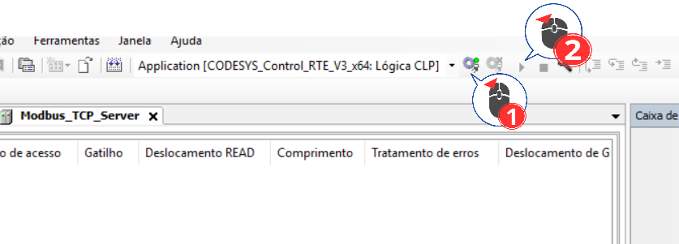

- Acessar a opção indicada na imagem.
- Realizar a configuração destacada pelo marcador **29**.
- Confirmar os parâmetros conforme o projeto Modbus.
- Validar se o item foi corretamente inserido na árvore do CODESYS.

⚠️ Atenção: qualquer valor diferente do mostrado na imagem pode impedir a comunicação.
💡 Dica: sempre salvar o projeto após concluir este passo.

---

### 🔹 Passo 30 – Etapa 30 da configuração Modbus
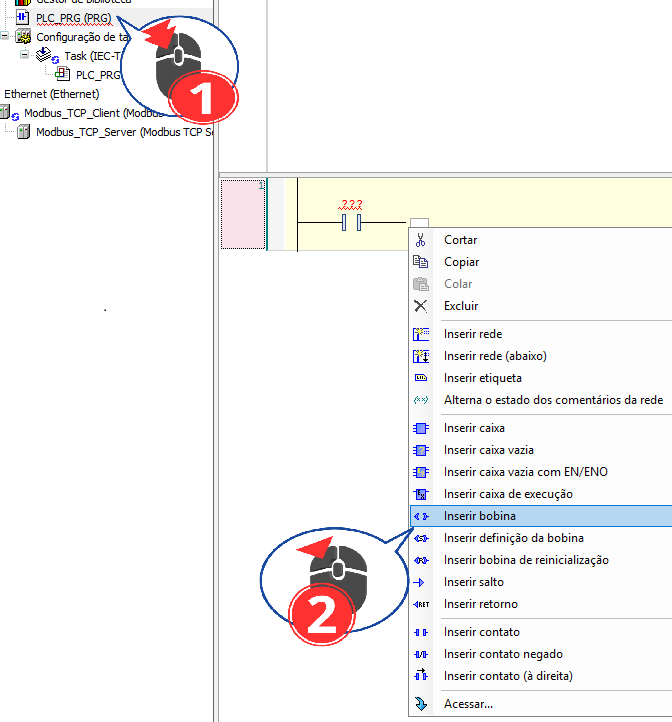

- Acessar a opção indicada na imagem.
- Realizar a configuração destacada pelo marcador **30**.
- Confirmar os parâmetros conforme o projeto Modbus.
- Validar se o item foi corretamente inserido na árvore do CODESYS.

⚠️ Atenção: qualquer valor diferente do mostrado na imagem pode impedir a comunicação.
💡 Dica: sempre salvar o projeto após concluir este passo.

---

### 🔹 Passo 31 – Etapa 31 da configuração Modbus
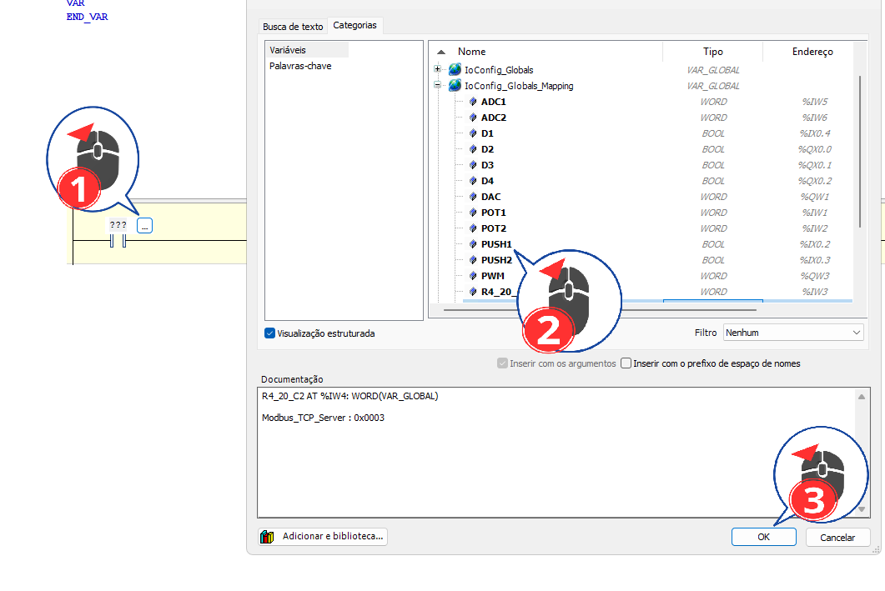

- Acessar a opção indicada na imagem.
- Realizar a configuração destacada pelo marcador **31**.
- Confirmar os parâmetros conforme o projeto Modbus.
- Validar se o item foi corretamente inserido na árvore do CODESYS.

⚠️ Atenção: qualquer valor diferente do mostrado na imagem pode impedir a comunicação.
💡 Dica: sempre salvar o projeto após concluir este passo.

---

### 🔹 Passo 32 – Etapa 32 da configuração Modbus

- Acessar a opção indicada na imagem.
- Realizar a configuração destacada pelo marcador **32**.
- Confirmar os parâmetros conforme o projeto Modbus.
- Validar se o item foi corretamente inserido na árvore do CODESYS.

⚠️ Atenção: qualquer valor diferente do mostrado na imagem pode impedir a comunicação.
💡 Dica: sempre salvar o projeto após concluir este passo.

---

## ✅ Resultado esperado

- Comunicação Modbus TCP ativa
- ESP32 reconhecida como remota
- Leitura e escrita de I/O funcionando

## 📚 Referência

https://github.com/ININDII-UFU/EININDII08_EspRemoteIO
